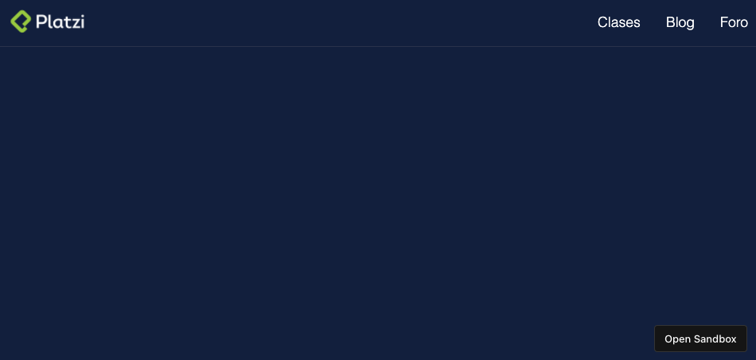
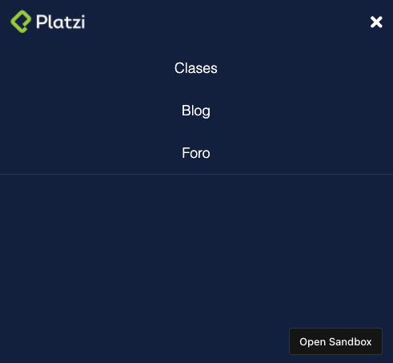

    

<h1 id="menu">
  
  Menu with HTML y CSS
</h1>

This project is a simple menu responsive using only HTML y CSS to make all the interactions and styles.

You can see it here → [Menu](https://i9pk7.csb.app).

## Table of contents

- [Menu](#menu)
- [Preview](#preview)
  - [Desktop](#desktop)
  - [Mobile](#mobile)
- [Technologies](#technologies)
- [Author](#author)

<h2 id="preview">
  
  Preview
</h2>

<h3 id="desktop">
  
  Desktop
</h3>

<h3 id="mobile">
  
  Mobile
</h3>

<h2 id="technologies">
  
  Technologies
</h2>

1. HTML
2. CSS vanilla

<h2 id="author">
  
  Author
</h2>

**AleX Camacho** - [@alexcamachogz](https://github.com/alexcamachogz)
